# Book Review App - Frontend

* This is the Frontend of the Book Review   application 'Reader's Voice', built with React.js.

# Features

* User Authentication (Register/Login via API)

* Add, view books

* View and add reviews on books

* Responsive UI using TailwindCSS

* API integration using Axios

# Tech Stack

* React.js

* Axios

* React Router

* TailwindCSS

* Fontawsome

* react toastify

# Project Structure

frontend/
├── src/
│   ├── components/    # Reusable UI components
│   ├── pages/         # Login, Register, BookList, BookDetails
│   ├── api/           # Axios instance setup
│   └── App.js         # Main React app
└── package.json

# Setup Instructions

cd frontend
npm install
npm start
Frontend will run on: https://readers-voice.netlify.app

# Screenshots

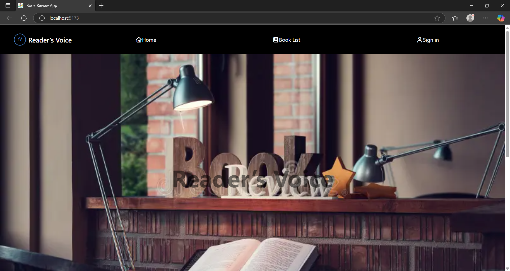 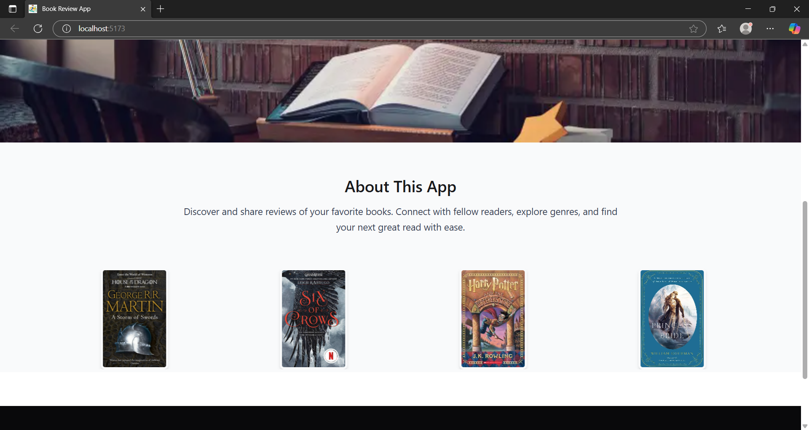 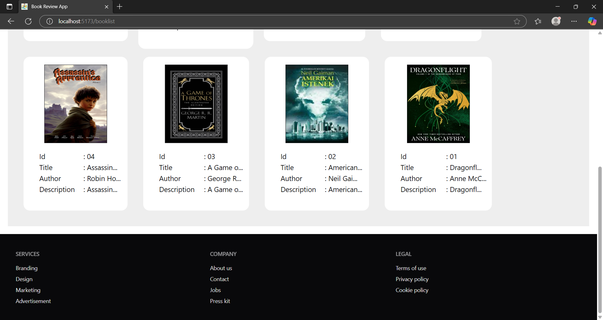 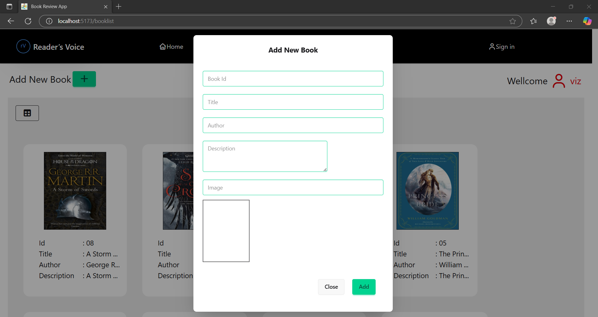 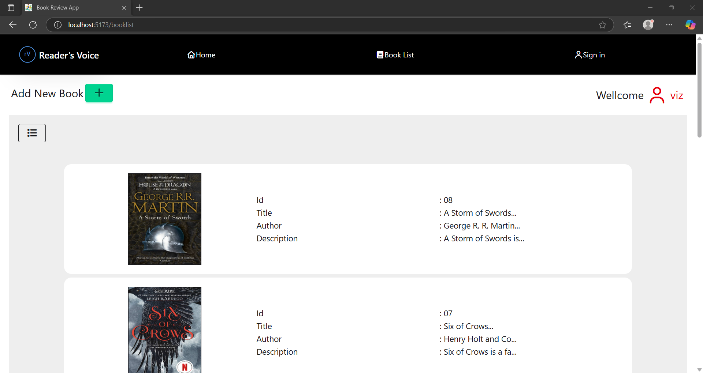 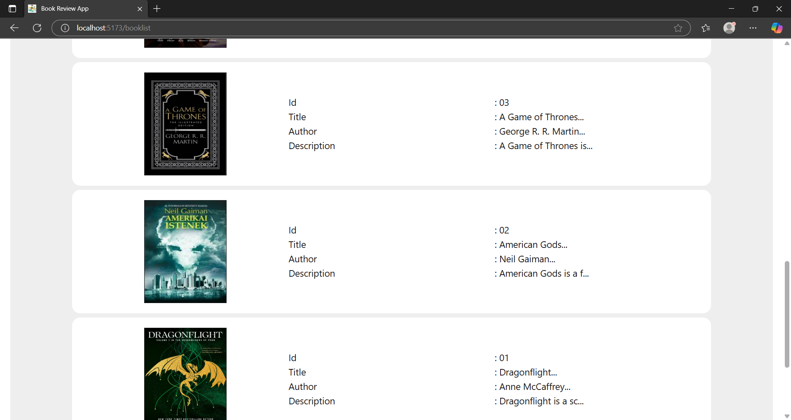 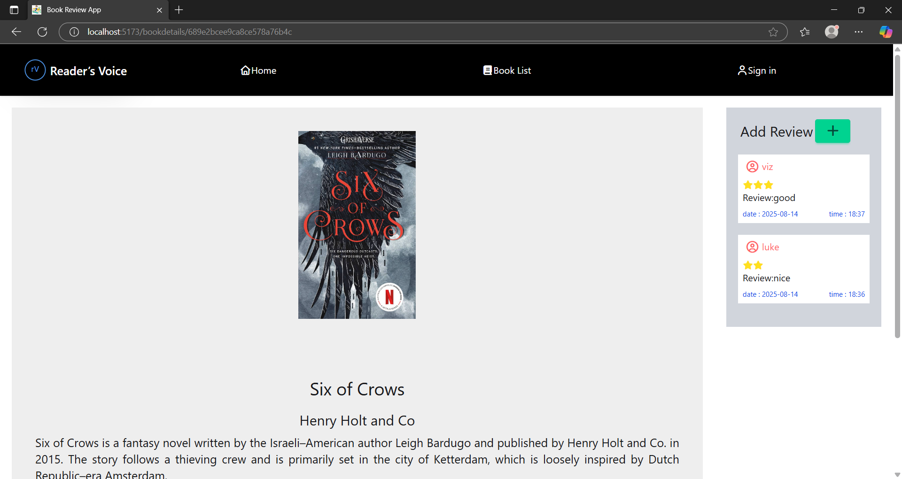 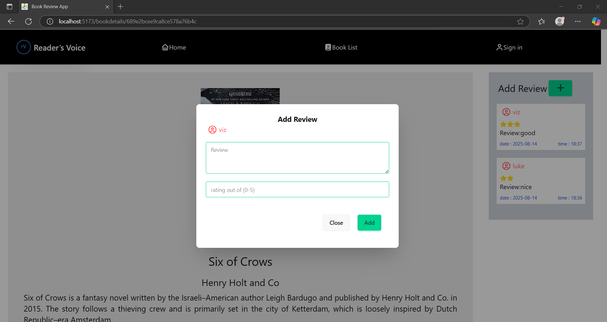 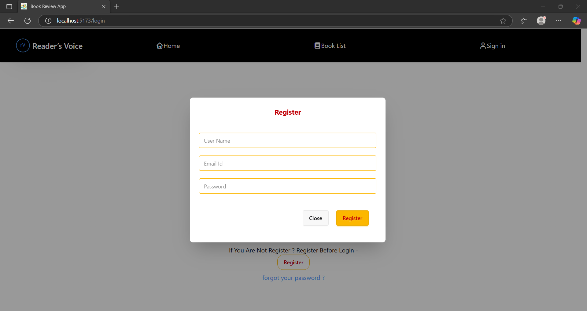 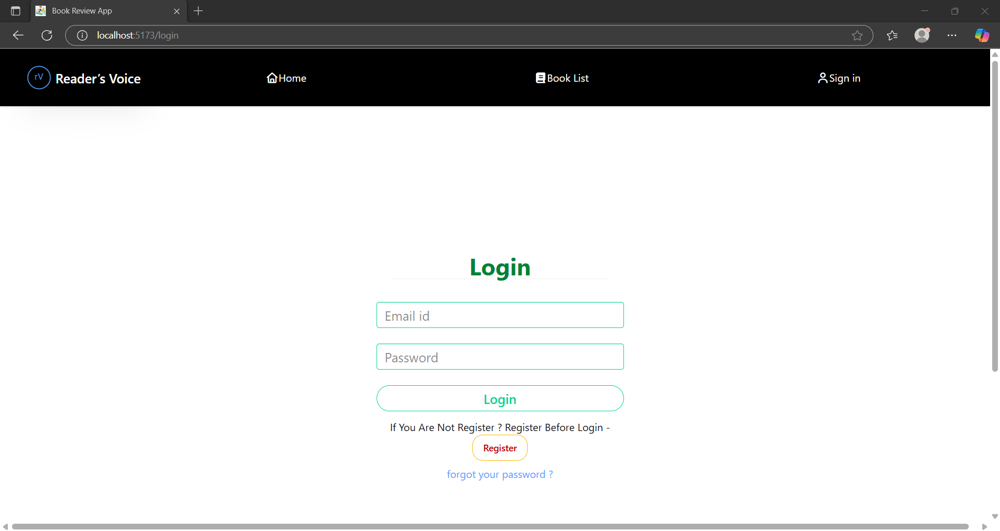 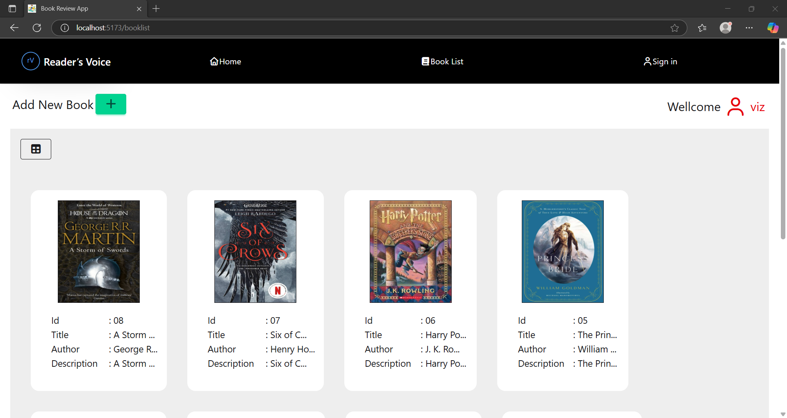

# Deployment

* Deploy frontend on netlify

# Author

* Developed by ABHIJITH P A